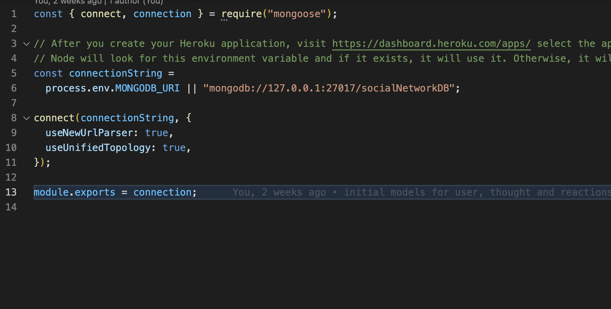
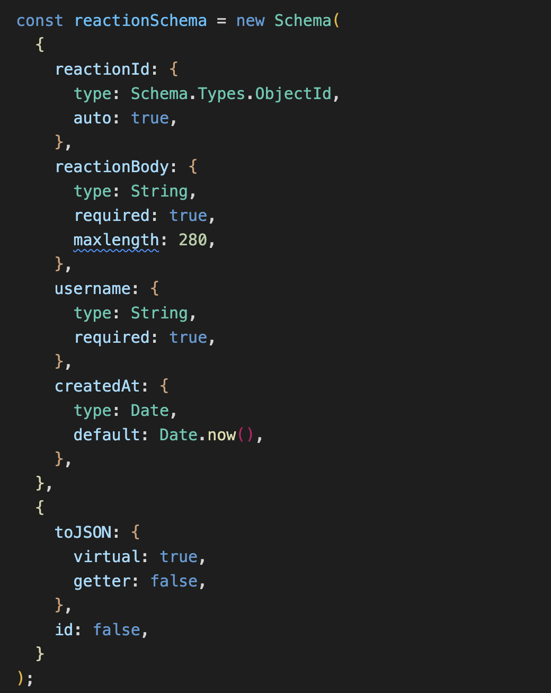
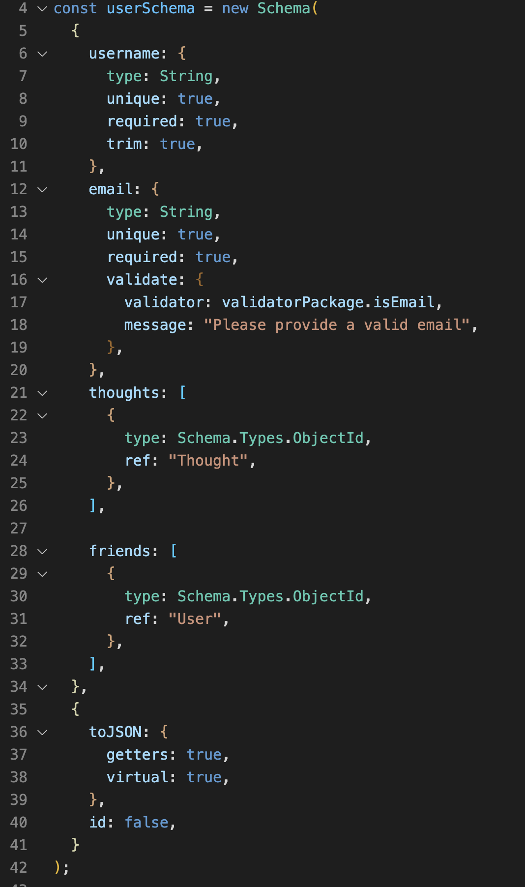
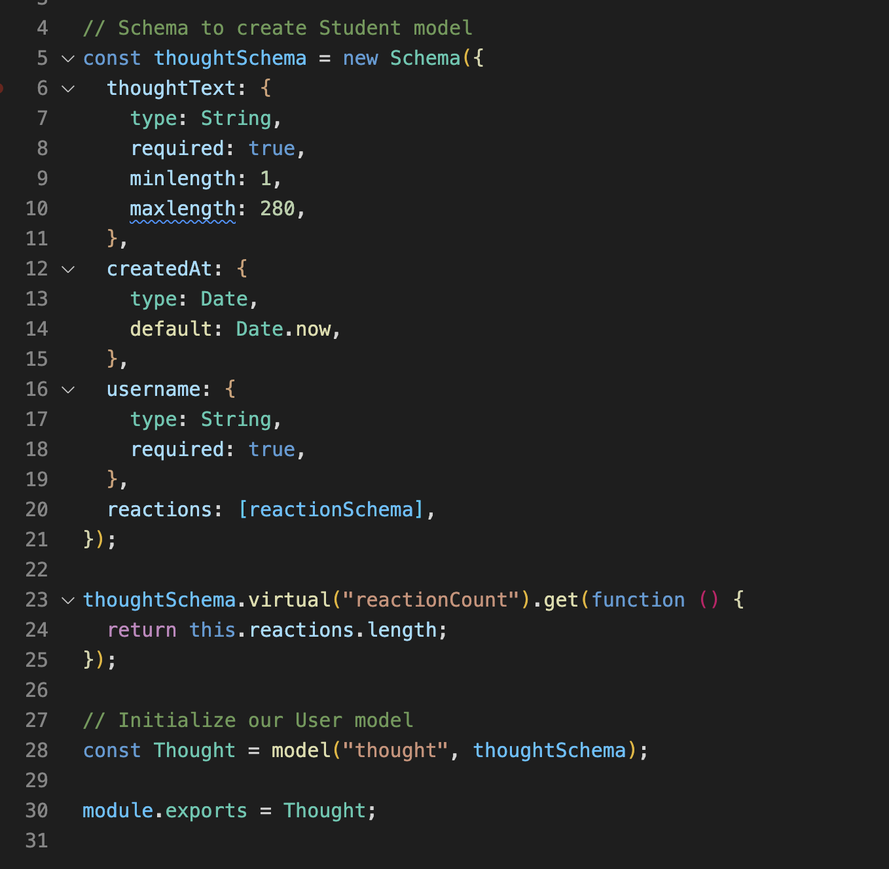

# week18-HW

# Links

[Github link 💾](https://github.com/frsargua/SocialNetworkApi)

# Table of Contents

- [Description](#description)
- [Installation](#Installation)
- [Usage](#Usage)
- [License](#License)
- [Contributing](#Contributing)
- [Tests](#Tests)
- [Questions](#Questions)

## Description

This app allows a user to save, check and delete notes. This app uses a JSON file as a database. Via the use of API routes through the backend.

## Installation

To run the app in the local server, clone the repository to your local memory follow the instructions below:

```
cd /SocialNetworkApi
npm install
```

If you are running it through local host, you will have to configure the connections.js file (inside the config folder) by changing line 6 to your own connection path to your own mongoDB database.



Then:

```
npm run start       <--- To run the app in a localhost
```

## Usage

```
Technologies used:
JavaScript - Node.js - Express.js - JSON - Mongo.db - Mongoose - Postman

```

- Below are screenshots of the deployed app in Heroku:
  
  
  

Functionality:

- Create an user
- Search User by Id
- Delete User
- Update User
- Add and remove friends
- Create, get, get by id, add, update and remove thoughts
- Add and remove reaction to thoughts

# License

This project is not covered by a license.

## Contributing

No contribution

## Tests

No tests available for this task.

## Questions:

GitHub: https://github.com/frsargua

email: frsargua@gmail.com
